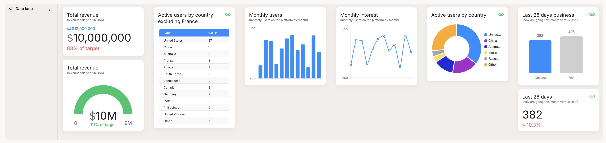

# Introduction to Metrics

Metrics are powerful tools that bring key data from your organization into your journey maps, enabling data-driven decision making, insight discovery, and opportunity spotting.

## What are Metrics in Journey Mapping? 🤔

Metrics in journey mapping are quantitative measurements that provide concrete data points to support and enhance your customer journey analysis. They help you:

- Validate assumptions about customer behavior
- Identify pain points and areas for improvement
- Measure the impact of changes to your customer experience
- Prioritize initiatives based on data-driven insights

:::tip
Incorporating metrics into your journey maps transforms them from static visualizations into dynamic, actionable tools for continuous improvement.
:::

## Quick look at adding a metric 👀

<video src="/smaply-knowledge/videos/metrics/add_a_manual_metric_card.mp4" autoPlay loop muted width="750px"></video>

## Data Sources for Metrics 📈

Smaply supports various data sources to populate your metrics:

1. **Manual Entry:** Ideal for quick updates or one-off data points
2. **Excel or CSV paste/import:** Perfect for bulk data or periodic updates
3. **Live Integration:** Connect directly to analytics and other data tools for real-time insights

:::info Integration Power
Leveraging live integrations ensures your journey maps always reflect the most current data, enabling agile decision-making.
:::

## Types of Metrics 📉📈📊

1. **Number Metrics:** Single values with optional targets, shown as gauges or simple numbers.
2. **Series Metrics:** Data trends or comparisons, visualized as pie, bar, horizontal bar, line charts, or tables.
3. **Comparison Metrics:** Compare two numbers, highlighting improvements or decrements.

:::tip Visualization Tip
Choose the right chart type to make your data easy to understand at a glance. Consider your audience and the story you want your data to tell.
:::

## Getting Started with Metrics 🚀

1. Identify key performance indicators (KPIs) relevant to your customer journey
2. Set up integrations or prepare your data for import
3. Add metric lanes to your journey map
4. Configure your metrics with appropriate visualizations and targets

:::note Best Practice
Start with manual metrics and quickly get the visulaization you want. Then transition to live data sources.
:::

