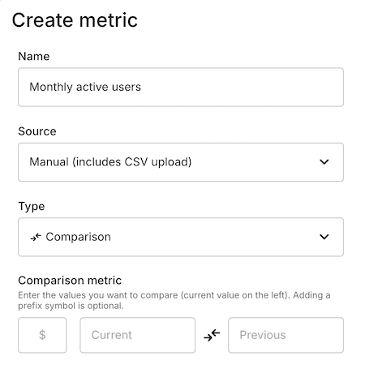
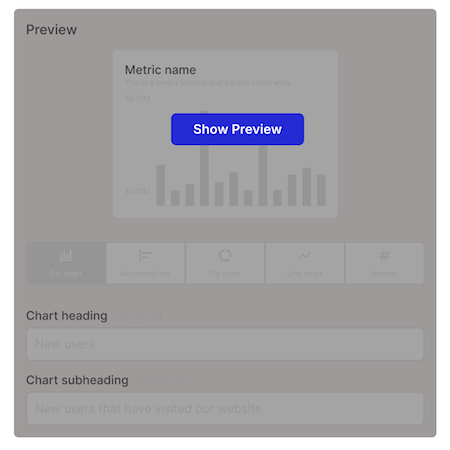

# How to add a manual Metric
Manual Metrics are the easiest way to get started using Metrics in your journey maps. They are simple to create and update and offer a range of flxible options to display your data.

## Watch a quick tutorial
<video src="/smaply-knowledge/videos/metrics/add_a_manual_metric_card.mp4" autoPlay loop muted width="750px"></video>

 
---
  

## Steps to add a manual Metric 

### 1. Add a Metrics card to your journey map: 
Add a Metrics card to a journey map.
| <video src="/smaply-knowledge/videos/metrics/add_metric_card_480.mp4" autoPlay loop muted width="325px"></video> |
|----------|

### 2. Create a new Metric:
Use the dropdown to select "**Create metric**" 

| <video src="/smaply-knowledge/videos/metrics/create_metric_dropdown.mp4" autoPlay loop muted width="325px"></video> |
|----------|

 
> **Note:** You can also add a new Metric via your Workspace menu. Navigate to "**Metrics**" then click on the "**Create metric**" button.
 

### 3. Enter Metric details:
   - **Name:** Enter a descriptive name for your metric (e.g., "Monthly visitors").
   - **Source:** Select "Manual (includes CSV upload)" from the "Source" dropdown menu.
   - **Type:** Choose the metric type:
     - **Series:** For a series of data points.
     - **Number:** For a single numerical value.
     - **Comparison:** For comparing two values.

 

 

### 4. Enter your data:
Depending on the "Type" selected, you will be shown different input options for your Metric. 

   **Series Metrics:**
      - A "Series" Metric shows a two-column table where you can enter a label and corresponding value. Click the "+ Add row" button below the table to manually add more rows.
   > **Note:** You can also **Upload CSV** or **Paste** directly into the table from external sources like Excel or Google Sheets.
 

   **Number Metrics:**
      - A "Number" Metric shows a singler text input with the option to add a prefix symbol (i.e. $)

 

   **Comparison Metrics:**
      - A "Comparison" Metric shows two text inputs, one for a Current value and another for a Previous value. You also have the option to add a prefix symbol.

 

### 5. Preview the Metric:
After entering your data, click the "Show preview" button on the right side of the screen.

 

 

### 6. Set Display defaults:
   Below the preview, you can set the "Display defaults" for this metric. 
   
  
   > **Note:** Changing display defaults **only impacts new cards**; existing cards linked to this metric on journey maps won’t be changed.
   

- **Chart Type:**   
Select the default chart type (options depend on the metric type and include Bar chart, Horizontal bar, Pie chart, Line chart, and Table). 
- **Chart Heading:**   
Add a heading for the chart (optional). 
- **Chart Subheading:**   
Add a subheading for the chart (optional).

- **Additional Options:**   
Depending on the chart type, configure additional options such as:
   - **Latest value as the headline:** Display the last value as a large number above the chart.
   - **Start values at zero on axis:** Ensure the chart starts at zero.
   - **Show titles on right:** Display titles on the right side of the chart.
   - **Target (Number Metrics only):** Compare the number against a target value.

| <video src="/smaply-knowledge/videos/metrics/metric_display_defaults.mp4" autoPlay loop muted width="750px"></video> |
|----------|

 

### 7. Save the Metric:
   Once you are satisfied with the details and display default settings, save the Metric.
