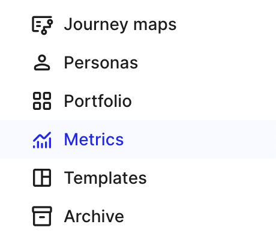
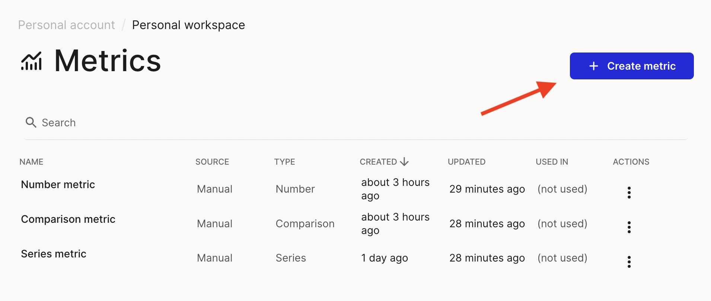

# How to add a manual Metric
Metrics can be created manually by directly inputing data, pasting from external sources (Excel/ Sheets), or CSV file upload.

## To add a manual metric, follow these steps:

### 1. **Navigate to the Metrics menu:**
In your Workspace, click on the "Metrics" menu.

 

### 2. **Create a new Metric:**
Click on the "Create metric" button.

<video src="/smaply-knowledge/videos/metrics/create-metric.mp4" autoPlay loop muted width="500"></video>

### 3. **Enter Metric details:**
   - **Name:** In the "Name" field, enter a descriptive name for your metric (e.g., "Monthly visitors").
   - **Source:** Select "Manual (includes CSV upload)" from the "Source" dropdown menu.
   - **Type:** Choose the metric type from the "Type" dropdown menu. The available options are:
     - **Series:** For a series of data points.
     - **Number:** For a single numerical value.
     - **Comparison:** For comparing two values.
 

### 4. Enter your data:
Depending on the "Type" selected, you will be shown different inputs for your Metric. 

   #### Series Metrics:
   If you selected "Series" as the Metric Type, a two-column table will appear:
      - **Label:** Enter a label for each data point.
      - **Value:** Enter the corresponding value.
      - You can also:
      - **Upload CSV:** Click the "Upload CSV" link to import data from a CSV file.
      - **Paste Data:** Use the tooltip to paste data directly into the table from external sources like Excel or Google Sheets.
      - **Add Row:** Click the "+ Add row" button below the table to manually add more rows.
 

   #### Number Metrics:
      If you selected "Number" as the Metric Type, a singler text input will appear. 
      - **Value:** Enter the value you wish to display. You can also choose to add a symbol.
      - **Symbol (Optional):** You can also choose to add a prefix symbol (i.e. $).
 

   #### Comparison Metrics:
      If you selected "Comparison" as the Metric Type, two text inputs will appear. 
      - **Current value:** Enter the values you wish to display. You can also choose to add a symbol.
      - **VPrevious value:** 

 
### 5. **Preview the Metric:**
   - After entering the data, the "Show preview" button on the right side of the screen will be activated. Click it to see a preview of the metric card you are creating.

 
### 6. **Set Display defaults:**
   Below the preview, you can set the "Display defaults" for this metric. 
   > **Note:** Changing display defaults only impact new cards; existing cards linked to this metric on journey maps won’t be changed.

   - **Chart Type:** Select the default chart type (options depend on the metric type and include Bar chart, Horizontal bar, Pie chart, Line chart, and Table).
   - **Chart Heading:** Optionally, add a heading for the chart.
   - **Chart Subheading:** Optionally, add a subheading for the chart.
   - **Additional Options:** Depending on the chart type, configure additional options such as:
     - **Latest value as the headline:** Display the last value as a large number above the chart.
     - **Start values at zero on axis:** Ensure the chart starts at zero.
     - **Show titles on right:** Display titles on the right side of the chart.
     - **Target (Number Metrics only):** Compare the number against a target value.

 
### 7. **Save the Metric:**
   Once you are satisfied with the details and display default settings, save the Metric.
