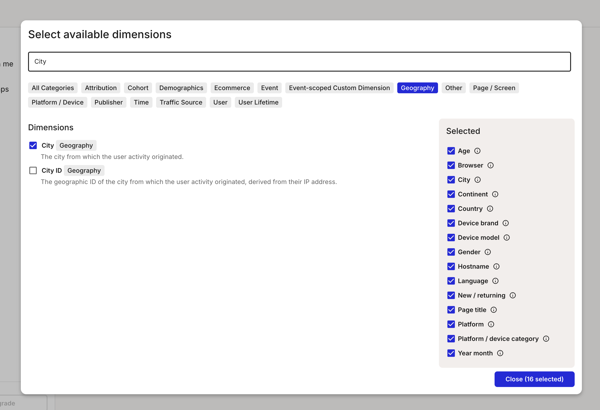
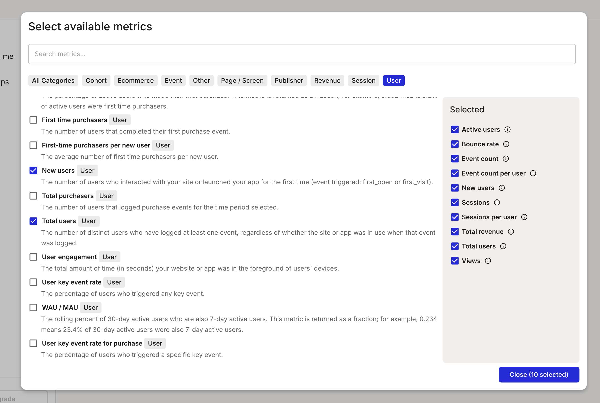

# Configuring the Google Analytics Integration

From the Account settings page, click on the "Integrations" section and then click 'Set up' or 'Edit' on the "Google Analytics" integration.

<video src="/smaply-knowledge/videos/metrics/setup_google_analytics.mp4" autoPlay loop muted width="750px"></video>

### Authenticate with a Service Account or OAuth

See detailed instructions:
  - [Service Account](30-service-account.md) 
  - [Google Account (OAuth)](40-o-auth.md)

### Configure Properties

A property in Google Analytics represents a website, mobile application, or device from which you want to collect data. It's a container for the data collected from your online presence.

Select all properties you want to use with Smaply. Each property will be available to the users that create metrics using the Google Analytics integration. Each property has its own set of dimensions and metrics.

### Configure Dimensions 

Dimensions are attributes of your data that are used to filter and group data in Smaply. They are made available to the users that create metrics using the Google Analytics integration.

:::tip
Keep it lean: only add dimensions that you need for your metrics. This will minimize the options a user has to consider, reducing confusion and making metrics easier to manage.
:::

### Configure Metrics

Metrics are the quantitative measurements of user activity on your site or app, such as the number of sessions, page views, or goal completions.

### Save Your Configuration

Click on the "Save" button to finalize your settings.

Congratulations! You have now configured the Google Analytics integration. You can proceed to create metrics with live data from Google Analytics.