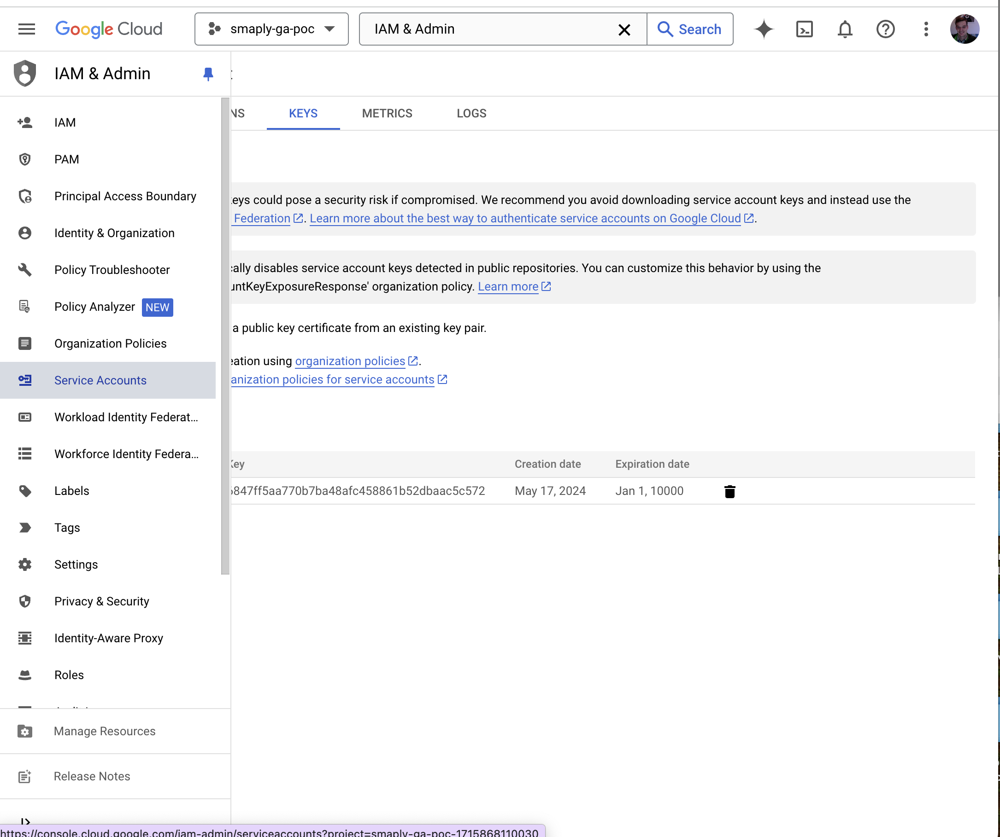
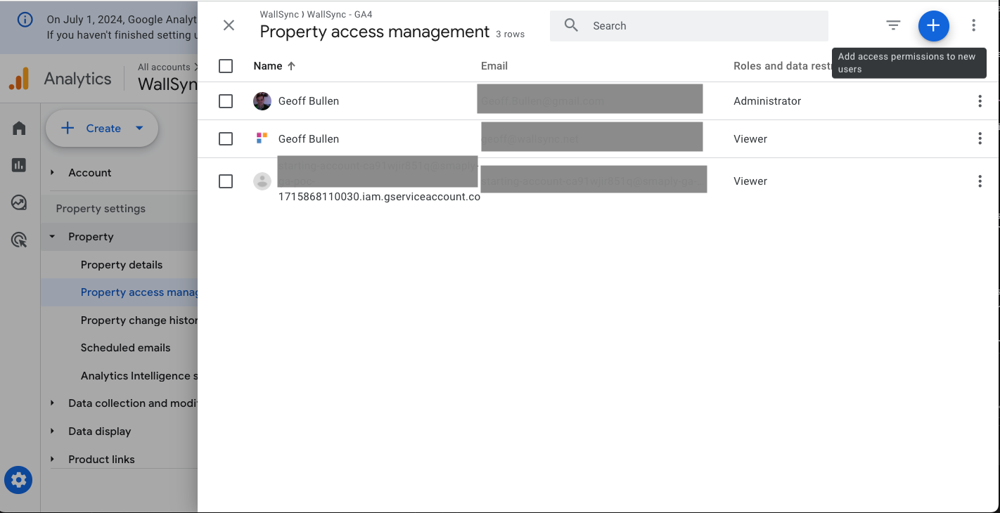

# Setting Up a Service Account for Google Analytics GA4 API 🔧

A service account acts as a virtual user for your application, allowing secure, programmatic access to Google Analytics data without using personal credentials.

## Steps to Create and Configure Service Account

### 1. Create a Google Cloud Project (if not already done)
1. Go to the Google Cloud Console: 
2. Click on "Select a project" > "New Project"
3. Enter a project name and click "Create"
4. Give it a sensible name like "Smaply-GA"

:::tip
 Creating a dedicated Google Cloud Project for Smaply allows you to keep all related API access and settings in one place. This makes it easier to manage permissions and track usage specific to your Smaply integration.
:::

### 2. Enable the Google Analytics Data API 📊
1. In your Google Cloud project, go to "APIs & Services" > "Library"
2. Search for "Google Analytics Data API"
3. Click on the API and then click "Enable"

:::warning **Important** 
Enabling the API is crucial for accessing GA4 data. Make sure you've completed this step before proceeding.
:::

### 3. Create a Service Account 🔑
1. In the [Google Cloud Console](https://console.cloud.google.com/), navigate to "IAM & Admin" > "Service Accounts"
2. Click "Create Service Account"
3. Enter a name and description for your service account
4. Click "Create and Continue"

### 4. Grant Permissions
1. In the "Service account permissions" section, add the following role:
   - "Viewer" (for read-only access) or "Editor" (for read-write access)
2. Click "Continue" and then "Done"

:::tip 🔒 **Security Tip:**
Always follow the principle of least privilege. Grant only the permissions necessary for your intended use case.
:::

### 5. Create and Download the Key File 📁
1. Find your newly created service account in the list
2. Click on the service account name
3. Go to the "Keys" tab
4. Click "Add Key" > "Create new key"
5. Choose "JSON" as the key type
6. Click "Create" to download the key file

### 6. Grant Access in Google Analytics 📈
1. [Log in to your Google Analytics account](https://analytics.google.com/analytics/web/)
2. Navigate to Admin > Property > Property Access Management
3. Click the "+" button to add a new user
4. Enter the service account email address (found in the key file or service account details)
5. Assign the appropriate role (e.g., Viewer or Editor)
6. Click "Add" to save the changes

:::tip 
If you need access to multiple GA4 properties, you can repeat this step for each property or use Google Analytics account-level access for broader permissions.
:::

## Troubleshooting

If you encounter issues during the OAuth process or property verification:

1. **No properties available**: Ensure your Google account has access to at least one Google Analytics property
2. **Insufficient permissions**: Check your access level in Google Analytics. You need at least "Read & Analyze" permissions for the properties you want to integrate

## Next Steps
- Finish setting up the integration in Smaply!!
