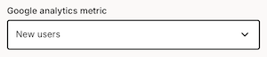

# Create a comparison metric

<video src="/smaply-knowledge/videos/metrics/create_comparison.mp4" autoPlay loop muted width="750px"></video>

### Get going 

1. Create a new metric either from the journey map or from the metrics page
2. Select source as "Google Analytics"
3. Select type as "Comparison"

### Select date range

Select a date range for the comparison.  The previous period is calculated relative to the selected date range.

### Select the metric

Select the metric you want to compare over the selected date ranges. 

:::tip
If you don't see the metric you want to compare, your administer can add it for you.  See [Google Analytics configuration](docs/documentation/metrics/integrations/google-analytics/Administration/20-google-analytics-config.md) for more information.
:::

### (Optional) Apply filters

### Preview and save

:::tip
If you don't see any data, check that the comparison period actually has data and that you don't have any filters that are returning no results.
:::

