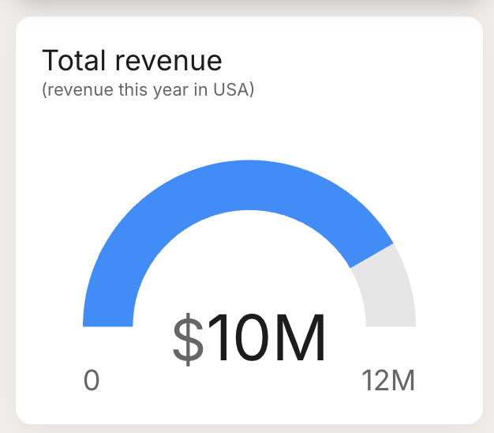

# Types of metrics

1. **Series Metrics:** Data trends or comparisons, visualized as pie, bar, horizontal bar, line charts, or tables.
1. **Number Metrics:** Single values with optional targets, shown as gauges or simple numbers.
1. **Comparison Metrics:** Compare two numbers, highlighting improvements or decrements.

## Series
Series metrics involve a sequence of data points collected over a period or categorically. This type allows for detailed analysis and visualization of trends, changes, and progressions in your data. For example, tracking monthly visitors over a year.

|  |  |
|--------------------|--------------------------------------------------|
 | **Bar Chart:** Visualizes data points as vertical bars, useful for comparing categories.
 | **Horizontal Bar:** Similar to the bar chart but with horizontal bars, ideal for long category names.
 | **Pie Chart:** Displays data as slices of a pie, showing relative proportions.
 | **Line Chart:** Plots data points on a line, best for showing trends over time.
 | **Table:** Lists data points systematically, suitable for detailed viewing.

## Number
Number metrics represent a single, standalone data value. This type is ideal for key figures or summary statistics that need to be highlighted, such as total number of users, one-time sales figures, or overall engagement rates.

|  |  |
|--------------------|--------------------------------------------------|
 | **Number:** Shows a single value prominently, ideal for displaying essential figures like total users or one-time sales.
 | **Gauge:** A semi-circular gauge that shows the value relative to a target value, perfect for giving a quick visual of performance against goals.

## Comparison
Comparison metrics allow you to compare two or more data points against each other. This type is perfect for side-by-side evaluations, such as comparing revenues from different months or contrasting user engagement between various features or campaigns.

|  |  |
|--------------------|--------------------------------------------------|
 | **Comparison:** Displays a number with a percentage change below, ideal for showing improvements or declines over a period.
 | **Bar Comparison:** Uses bars to compare different data points visually, making it easy to see which data point performs better.